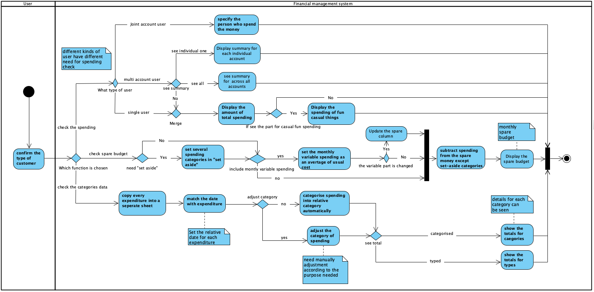

[BACK](../README.md)
***
#Report for Coursework 2
##Brief Introduction:
The following report will discuss in detail about **specification generating** and **modelling process** for building a personal financial management system. The **prototypes** ...... The **activity diagram** illustrates different conditions the management system may meet as well as decisions will be made, and step-by-step procedure of different chioces of managing users' finance. The **Scenarios** include two types of users which are single account user and joint account user. We record the detail of using progress under their context, respectively.

**Contents** are as follows:
- [1. Prototypes](#1-prototypes)
- [2. Activity diagram](#2-activity-diagram)
- [3. Scenarios](#3-scenarios)
- [4. Contributors](#4-contributors)
***
## 1. Prototypes
- ### Description with assumptions & questions
  
- ### Diagram
  
***
## 2. Activity diagram
- ### Reasoning for why it is chosen
  We choose to use activity diagram to illustrate how **different kinds of users** can manage their financial accounts simply by using this managements system with **several functions** that meet their requirements. 
Initially, I need to confirm what kind of user I am. If I am a **single-account-single-customer** (condition: if a single-account-single-customer or multi-account-user or joint-account-user?), then I will be able to choose among three basic functions that serve well for managing (condition: if choose to know how much spend or spare budget or categorised data).  
If, in one case, I choose to generally **know how much I spend**, I can simply get the total money that system returns. Then I can choose whether to know how much spent on fun casual things (condition: if show fun casual spending?).  
If, in another case, I choose to **know an available spare budget** for me. I need first to set zero or several categories of spending for "set aside". The system will first figure out the total available amount of money without including the set-aside one. Whenever I spent money, and the money is not in the "set aside" (condition: if not in set aside), the system will subtract that amount from the total (condition: if spend money?). If I have categories that are variable but definitely scheduled to go out (condition: if definitely scheduled but variable?), the system will set an average of usual cost for those categories, and update it when it is actually spent. After this, the spare money column will be changed positively or negatively (condition: if the variable one out of the set average amount?). If I decided to set some kinds of money aside, The system will subtract certain kinds of spending from this "set-aside", instead of the total one. Then I can see a total of how much is exactly fixed to date in this month. 
If, in other case, I choose to **see categorised data**, the system will first copy every expenditure into a seperate sheet. Then it collects the date of these expenditures. Finally, system will categorise spending into relative category automatically. If something need to go to a different category instead of default (condition: if a expenditure has different purpose?), I can change it for a transaction. After all I can see the totals for categories or types (condition: if see categorised or typed?). 
Apart from these basic functions, several features are provided if I am not just a single-account-single-customer. If I am a multi-account user, I can see summary for each individual account or across all accounts (condition: if see single or total?). 
If I am a joint-account user, the system will note every amount of money with the person who spent it. Then I can see who spent certain money. 
Throughout this process, **many choices of management** are provided by the system and **step-by-step actions** are involved. With an activity diagram, it clearly shows how the whole checking and recording **process flows** and how financial management decisions are made **in different conditions**.
 

- ### Diagram
  
- ### Description with assumptions & question
> 1. **Descriptin**
   We assume our user can successfully log into our software and link their accounts to the financial management system.
   The software should provide communications, in other words, management relationship, between users and their own accounts. To accomplish this, the software contains three main functions. 
   The first one is to hava a general view of the monthly spending, which is showing the total amount of money spent so far in this month.
   The second feature provides with an ability to show the spending in categories. It also allows user to modify the catogories for a transaction.
   The third main function can show the exact money fixed this month. Users can also set several caegories into a "set aside" part, from which the spare calculating system will not subtract money.

> 2. **Question**
   How shall we deal with people with no account?
   How is it supposed to be for users to go back to choose other funcions as they've entered one already?
   It is said in the requirement that there exists default categories. In this case, what should they be?
   Log in and log out are not clearly expressed, please provide detailed information about these functions.

***
## 3. Scenarios
- ### Reasoning for why it is chosen
  A Scenario involves a situation that may have single or multiple actors that take a given functionality or path to resolve the scenario. Scenario is a structured description of process with defining a context, several actors, and goals. Our scenario includes two types of users which are single account user and joint account user. We record the detail of use progress under their context, respectively. 
Firstly, we want to confirm what kind of user he is after signing in, we prepare different strategies for different types. Then Our App need to get the data of basis of incomes and properties. After that, it will provide chance to make their own strategies of budgets. User can set according to their need. During the using time, App provides the messages of situation and allows user to check at any time. Also, some offline spending could be recorded manually. At the end of month, App will collect and analyze the final data and return to customers. We also provide options for the remaining money.
Comparing with other diagrams or textual description, 
Scenario has  these **advantages**:
> 1.	Comparing with UML diagram, scenario can record more details, contexts of the progress. Because we have chosen the activity diagram, scenario can add this information for our report.
> 2.	Comparing with user story or persona, scenario is more structured and help people to understand the use case in a certain situation.
> 3.	It is easier for customers to understand the progress of software. Because it has a plot rather than abstract professional concept.

- ### Diagram
  [Scenarios.md](cw2/scenario.md)
- ### Description with assumptions & questions
> 1. **Descriptin**
We assume that all the access authorities of other applications could be permitted according to their protocols.
Also assume that users can set rational strategies and not modify the plan randomly. 

> 2. **Questions:**
Because of requiring too many application’s access authorities, users might concern with the security. Setting a safe structure and protecting the data of users must be done.
For some offline spending or some invisible budgets, users might forget and leave them out. It is also necessary to process with it to provide a clear and precise strategy. 

  
***
## 4. Contributors
|Work|Contributors|
|---|---|
| Prototypes | Hongming & Yukai |
| Activity Diagram | Jiawei & Shiliang |
| Scenarios | Haonan & Yuxiang |
***
[BACK](../README.md)
